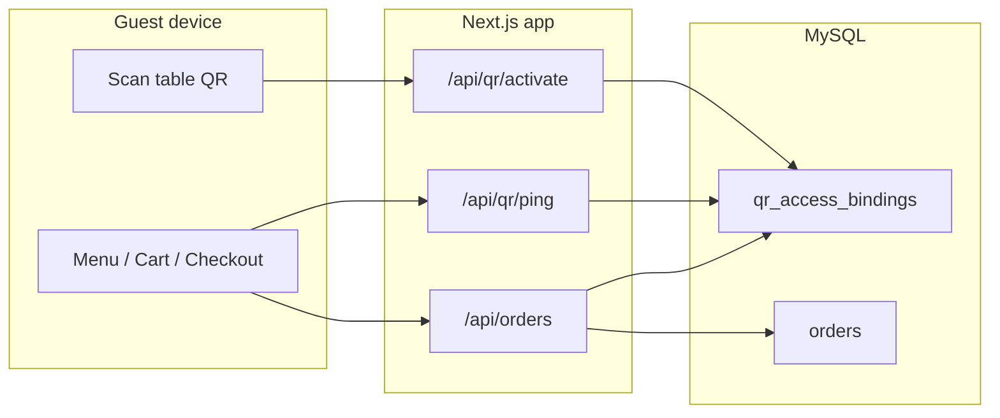

# BrenCravings — Mini QR Restaurant Ordering System

A mobile-first restaurant ordering platform: guests scan a printed table QR code to unlock ordering on their phone; staff run the kitchen from a live admin dashboard with QR session monitoring and manual overrides.

**Stack:** React 19 · Next.js 16 · Tailwind CSS 4 · Node.js · MySQL 8

---

## Live demo

| App | URL |
|-----|-----|
| Customer menu | [https://brencravings.vercel.app](https://brencravings.vercel.app) |
| Admin dashboard | [https://brencravings-admin.vercel.app](https://brencravings-admin.vercel.app) |

**Admin login:** `admin` / `admin12345`

The deployed sites are ready to use — no local setup required for a quick demo.

---

## Architecture

The app is a single Next.js project with **two logical surfaces**:

| Surface | Production host | Purpose |
|---------|-----------------|---------|
| **Customer** | `brencravings.vercel.app` | Menu, cart, checkout, order tracking |
| **Admin** | `brencravings-admin.vercel.app` | Live orders, QR generator, Active QR Sessions |

On **localhost** and **LAN IP** (`192.168.x.x`), both surfaces run on the same origin (`http://localhost:3000` or `http://192.168.x.x:3000`). QR enforcement is **always on** in every environment.



**Session model:** A signed cookie (`bc_qr_order_session`) plus a row in `qr_access_bindings` tie one **device** to one **table QR** (`access_jti`). Orders are rejected unless both are valid.

---

## Customer app

### What guests can do

| Feature | Description |
|---------|-------------|
| **Browse menu** | Products by category (Starters, Mains, Desserts, Beverages) |
| **Cart** | Add/remove items, quantity stepper, mobile cart sheet |
| **Checkout** | Dine-in (table from QR) or takeout; payment: cash on delivery or mock GCash |
| **Order tracking** | Live status: received → preparing → serving → served → completed |
| **Order history** | Past orders for the same device (session storage) |
| **Cancel order** | Guest can cancel while kitchen has not completed the order |

### Ordering gate (QR required)

Guests **must scan a valid table QR** before they can order.

| Guest action | Result |
|--------------|--------|
| Opens menu **without** scanning | Browse only — **cannot order** |
| Types `?table=1` in the URL bar | Still **cannot order** (no signed `access` token) |
| **Scans** a valid table QR | Cart and checkout unlock on **that device only** |

This is intentional — it reduces spam and fake orders. Only guests at a real table with a printed QR can place dine-in orders.

### Guest flow (happy path)

1. Staff prints a table QR from the admin sidebar (**Table QR codes** → table number → **Go** → download PNG).
2. Guest scans the QR → lands on `/menu-page?table=N&access=…`.
3. App calls `GET /api/qr/activate` → server binds the device, sets session cookie.
4. Guest adds items, checks out, pays (COD or mock GCash).
5. `POST /api/orders` creates the order; admin sees it on **Live Orders** within ~5 seconds.
6. Guest tracks progress on **Orders**; staff update payment and kitchen status in admin.

---

## QR session management

QR sessions control **who may order** and **which table** a device represents. Rules are identical on localhost, LAN, and production.

### One device per QR

The first phone to scan a table QR **locks** that printed code to its `device_id` (stored in session storage). A second phone scanning the same QR while the session is active sees:

> *This QR link is registered to another device. Scan the code on your own phone to order.*

### Automatic session end (QR released)

When any rule below fires, the server **deletes** the `qr_access_bindings` row and clears the session cookie. The printed QR is immediately available for the next guest.

| Trigger | What happens |
|---------|----------------|
| **2 minutes idle** | No scroll, tap, click, type, wheel, or navigation within menu / checkout / orders. Client checks every **10s**; timer resets on any activity. |
| **Close tab or browser** | `pagehide`, `beforeunload`, and Android `freeze` send logout via `sendBeacon` + `fetch(keepalive)`. |
| **Leave ordering flow** | Navigating outside `/menu-page`, `/checkout`, `/orders` ends the session (e.g. opening admin). |
| **Force-quit / failed unload** | If the browser never sends logout, the server treats the binding as **abandoned** after **~45 seconds** without heartbeat (`last_active_at`), or **2 minutes** of user inactivity. |
| **Admin terminate** | Staff force-end from **Active QR Sessions** (see below). |

### Session continuity (same device)

While the guest stays in the ordering flow on the **same device**, the session persists:

- Menu ↔ checkout ↔ orders navigation (including bare `/menu-page` without `?table=&access=` in the URL — server session is restored).
- Server heartbeats via `GET /api/qr/ping` every **15–30s** while the tab is visible and the guest is within the 2-minute activity window.

### Frontend enforcement

| Mechanism | Role |
|-----------|------|
| `useOrderingInactivity` | Tracks user activity; ends session after 2 min idle |
| `useQrSessionLifecycle` | Tab/browser close and flow-exit logout |
| `TableProvider` | Syncs session from server; handles admin-terminated sessions |
| `OrderingGuard` | Blocks checkout when ordering is disabled |

### Backend enforcement

| Endpoint / guard | Role |
|------------------|------|
| `GET /api/qr/activate` | Validates signed `access` token; binds device via `bindQrAccessToDevice()` |
| `GET /api/qr/session` | Returns `{ active, table }` or `{ terminated: true }` |
| `GET /api/qr/ping` | Heartbeat; updates `last_active_at`; rejects dead bindings |
| `POST/GET /api/qr/logout` | Releases binding and clears cookie |
| `assertQrOrderAllowed()` | Rejects `POST /api/orders` without a valid QR session |

### Admin: Active QR Sessions

Route: **`/admin/qr-sessions`** (sidebar: **Active QR Sessions**; mobile bottom nav: **Sessions**).

| UI element | Behavior |
|------------|----------|
| **Session list** | All rows in `qr_access_bindings`; refreshes every **5s** |
| **Active badge** | Last heartbeat within **10 seconds** |
| **Idle badge** | No heartbeat for **10+ seconds** — display only; session **not** auto-terminated |
| **Auto-remove** | Rows that meet automatic termination rules are purged on each list fetch |
| **Terminate Session** | Confirmation modal → `DELETE /api/admin/qr-sessions/[access_jti]` → binding deleted immediately; guest signed out on next request |

Columns shown per session: table number, session ID (`access_jti`), device ID, start time (`bound_at`), last active (`last_active_at`).

---

## Admin dashboard

Route: **`/admin`** (production: admin hostname only).

### Live Orders

| Feature | Description |
|---------|-------------|
| **Payment tabs** | Pending · Paid · Completed · Cancelled |
| **Kitchen board** | Drag-style workflow for Pending/Paid: received → preparing → serving → served → completed |
| **Order detail modal** | Full line items, payment method, table, status controls |
| **New-order notifications** | Browser notifications when new orders arrive (with permission) |
| **Auto-refresh** | Polls every **5s** while tab is visible |

**Kitchen rule:** An order can only be marked **completed** when payment is **Paid**.

### Table QR codes (sidebar)

1. Enter table number → **Go**
2. Server issues a signed `access` token (`POST /api/admin/table-qr-token`)
3. Download printable PNG (includes one-device instruction text)
4. Guest scans → customer app URL with `?table=` and `?access=`

### Auth

- Session cookie: `bc_admin_session` (HMAC-signed, 7-day TTL)
- Optional machine access: `x-admin-key` header when `ADMIN_API_KEY` is set

---

## Database

Run **`mysql/schema.sql`** in MySQL Workbench (entire file, Execute). Safe to re-run.

| Table | Purpose |
|-------|---------|
| `products` | Menu items (name, price, category, image) |
| `admin_users` | Admin login (seed: `admin` / `admin12345`) |
| `orders` | Orders (items JSON, payment, kitchen status, table, device) |
| `qr_access_bindings` | Active QR device locks (`access_jti`, `table_number`, `device_id`, `bound_at`, `last_active_at`) |

```sql
USE mini_qr_ordering;
DESCRIBE qr_access_bindings;  -- must include last_active_at
```

More detail: **[docs/MYSQL_SETUP.md](docs/MYSQL_SETUP.md)**

---

## Installation

**Prerequisites:** Node.js 20+, MySQL 8, MySQL Workbench (or any MySQL client)

### 1. Clone and install

```bash
git clone <your-repo-url>
cd mini-qr-ordering-system
npm install
```

### 2. Database

Open **`mysql/schema.sql`** in MySQL Workbench → select all → Execute. Confirm four tables exist in `mini_qr_ordering`.

### 3. Environment

On first `npm run dev`, the project copies **`.env.example`** → **`.env.local`** (not committed to git).

```bash
npm run dev
```

### 4. Configure `.env.local` (if needed)

| Variable | Local default | Notes |
|----------|---------------|-------|
| `MYSQL_HOST` | `127.0.0.1` | Always localhost for local MySQL |
| `MYSQL_PASSWORD` | *(empty)* | Set if your `root` user has a password |
| `MYSQL_DATABASE` | `mini_qr_ordering` | Must match schema |
| `NEXT_PUBLIC_APP_URL` | `http://localhost:3000` | QR link base URL |
| `NEXT_PUBLIC_ADMIN_APP_URL` | `http://localhost:3000` | Admin base (same origin locally) |
| `NEXT_PUBLIC_API_BASE_URL` | *(empty)* | Same-origin API; leave empty on Vercel |
| `ADMIN_SESSION_SECRET` | *(empty)* | Dev fallback exists; **required** on Vercel |
| `ADMIN_API_KEY` | *(optional)* | Server-side admin API key |
| `NEXT_PUBLIC_ADMIN_API_KEY` | *(optional)* | Sent as `x-admin-key` from admin UI |

**Common error:** `Access denied for user 'root'@'localhost' (using password: NO)` → set `MYSQL_PASSWORD` and restart `npm run dev`.

Do **not** commit `.env.local` or real passwords.

### 5. Open the app

| Where | Menu | Admin |
|-------|------|-------|
| This PC | [localhost:3000](http://localhost:3000) | [localhost:3000/admin](http://localhost:3000/admin) |
| Phone (same Wi‑Fi) | `http://192.168.x.x:3000` | `http://192.168.x.x:3000/admin` |

Use the **Network** URL from the terminal (not `0.0.0.0`). See **[docs/LOCAL_NETWORK.md](docs/LOCAL_NETWORK.md)** for LAN QR testing.

**Smoke test:** [localhost:3000/api/products](http://localhost:3000/api/products) should return JSON menu items.

### 6. Scripts

| Command | Purpose |
|---------|---------|
| `npm run dev` | Start dev server (auto LAN origin for QRs) |
| `npm run build` | Production build |
| `npm run start` | Run production build |
| `npm run lint` | ESLint |
| `npm run dev:api` | Optional standalone Express API — [docs/BACKEND_API.md](docs/BACKEND_API.md) |

---

## Production deployment (Vercel + Railway)

QR session logic runs on **Vercel**; MySQL lives on **Railway** (or any hosted MySQL). The app and database must share the same schema.

### Checklist

1. **Push to `main`** — Vercel redeploys customer and admin projects.
2. **Railway MySQL** — enable **public** networking; set `MYSQL_HOST` / `MYSQL_PUBLIC_URL` on Vercel (not `mysql.railway.internal`).
3. **Run `mysql/schema.sql`** on the **production** database (Workbench → Railway public host from **Connect**).
4. **Verify `last_active_at`** exists on `qr_access_bindings`.
5. **Set `ADMIN_SESSION_SECRET`** on Vercel (long random string).
6. **Hard-refresh** test phones or use incognito after deploy.

### Verify QR sessions in production

1. Phone A scans table QR → orders successfully.
2. Phone B scans **same** QR → blocked (*registered to another device*).
3. Phone A closes browser tab → within ~45s–2min, Phone B can scan.
4. Admin **Active QR Sessions** shows the binding; **Terminate** frees the QR immediately.

Guides: **[docs/VERCEL.md](docs/VERCEL.md)** · **[docs/RAILWAY.md](docs/RAILWAY.md)**

---

## API reference

### Customer

| Method | Path | Auth | Purpose |
|--------|------|------|---------|
| GET | `/api/products` | — | Menu products |
| POST | `/api/orders` | QR session + device | Place order |
| GET | `/api/orders` | — | List orders (device-scoped) |
| GET | `/api/orders/[id]` | — | Order detail |
| POST | `/api/orders/[id]/cancel` | — | Guest cancel |
| POST | `/api/orders/history` | — | Order history by device |
| GET | `/api/qr/activate` | `table`, `access`, `device_id` | Validate scan; set cookie; bind device |
| GET | `/api/qr/session` | Cookie + `device_id` | `{ active, table }` or `{ terminated }` |
| GET | `/api/qr/ping` | Cookie + `device_id` | Heartbeat; refresh `last_active_at` |
| POST / GET | `/api/qr/logout` | Cookie + `device_id` | End session; release binding |

### Admin

| Method | Path | Auth | Purpose |
|--------|------|------|---------|
| POST | `/api/admin/auth/login` | — | Admin login |
| POST | `/api/admin/auth/logout` | — | Admin logout |
| GET | `/api/admin/auth/session` | Admin cookie | Current session |
| GET | `/api/admin/orders` | Admin | List all orders |
| PATCH | `/api/orders/[id]/payment` | Admin | Update payment status |
| PATCH | `/api/orders/[id]/status` | Admin | Update kitchen status |
| POST | `/api/admin/table-qr-token` | Admin | Issue signed QR `access` token |
| GET | `/api/admin/qr-sessions` | Admin | List active QR bindings (purges abandoned) |
| DELETE | `/api/admin/qr-sessions/[access_jti]` | Admin | Force-terminate a session |

Admin routes require the **admin hostname** (or localhost / LAN in development) and a valid admin session cookie, unless `x-admin-key` matches `ADMIN_API_KEY`.

---

## Troubleshooting

| Problem | Likely cause | Fix |
|---------|--------------|-----|
| Cannot order after scan | Binding or cookie invalid | Rescan QR; check `/api/qr/session` |
| Second phone blocked while first guest gone | Stale binding | Wait ~45s–2min, or admin **Terminate Session** |
| QR works locally, not on Vercel | Production DB missing `last_active_at` | Run `schema.sql` on Railway |
| `mysql.railway.internal` error | Private Railway host on Vercel | Use public `MYSQL_PUBLIC_URL` |
| Admin 404 on customer URL | Wrong host | Use admin hostname or `/admin` on localhost |
| Orders empty in admin | MySQL not connected | Check Vercel env vars and Railway status |

---

## Project structure (high level)

```
app/
  menu-page/          Customer menu
  checkout/           Checkout flow
  orders/             Order list & tracking
  admin/              Admin dashboard + qr-sessions
  api/                Route handlers (orders, qr, admin)
components/
  admin/              Live orders, QR sessions, QR sidebar
  table/              TableProvider (QR session sync)
hooks/                Inactivity, lifecycle, live order sync
lib/
  mysql/              DB access (orders, products, qr_access_bindings)
  qr-*.ts             Session, inactivity, binding, activation
mysql/schema.sql      Database schema + seed data
```

---

## Documentation

| Topic | File |
|-------|------|
| MySQL setup | [docs/MYSQL_SETUP.md](docs/MYSQL_SETUP.md) |
| LAN / phone testing | [docs/LOCAL_NETWORK.md](docs/LOCAL_NETWORK.md) |
| Vercel deployment | [docs/VERCEL.md](docs/VERCEL.md) |
| Railway MySQL | [docs/RAILWAY.md](docs/RAILWAY.md) |
| Express API (optional) | [docs/BACKEND_API.md](docs/BACKEND_API.md) |

---

## Tech stack

| Layer | Technology |
|-------|------------|
| Framework | Next.js 16 (App Router, Route Handlers) |
| UI | React 19, Tailwind CSS 4 |
| API | Node.js serverless functions on Vercel |
| Database | MySQL 8 (`mysql2` connection pool) |
| Auth | HMAC-signed cookies (admin + QR order sessions) |
| QR | `qrcode` PNG generation; signed JWT-style access tokens |
